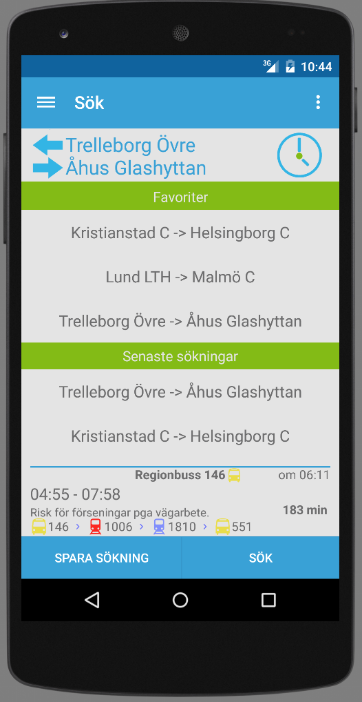
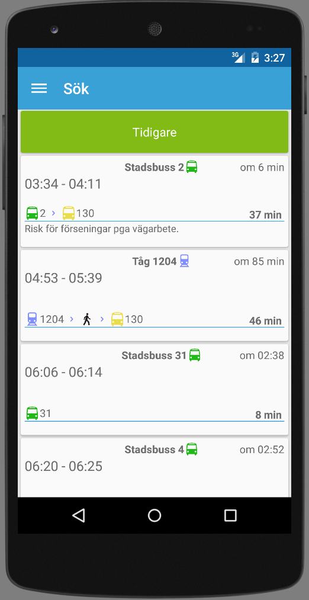

Transit
=======
Android app used to search for journeys with Skånetrafiken.

## Reporting
Note that the reporting at the moment only will pass your report on to everyone else and leave them with a push notification. Without consideration to if they want the report or not.
So if you don't want to receive reports from other users (since they probably won't be relevant to you), just uncheck the option in the settings.

Also reporting require me to run the backend server, so if you get a message telling you that backend server is offline. That's because I'm not running the server at the moment.

## Installation
Install by downloading the Transit.apk to your phone. The phone will ask you to allow installation of unknown software, do that -> Profit

The APK might not be the latest, but I'll try to keep it up to date.

## Backend Server
Google Cloud Messaging XMPP
[Backend found here](https://github.com/jakkra/GCM-Server)

##Licence
RT90-To-WGS-84.jar is a compiled version of [github.com/coober/coordinate-transformation-library](https://github.com/goober/coordinate-transformation-library) with  [Licence](http://www.apache.org/licenses/LICENSE-2.0)

Copyright [2015] [Jakob Krantz]

Licensed under the Apache License, Version 2.0 (the "License");
you may not use this file except in compliance with the License.
You may obtain a copy of the License at

    http://www.apache.org/licenses/LICENSE-2.0

Unless required by applicable law or agreed to in writing, software
distributed under the License is distributed on an "AS IS" BASIS,
WITHOUT WARRANTIES OR CONDITIONS OF ANY KIND, either express or implied.
See the License for the specific language governing permissions and
limitations under the License.
